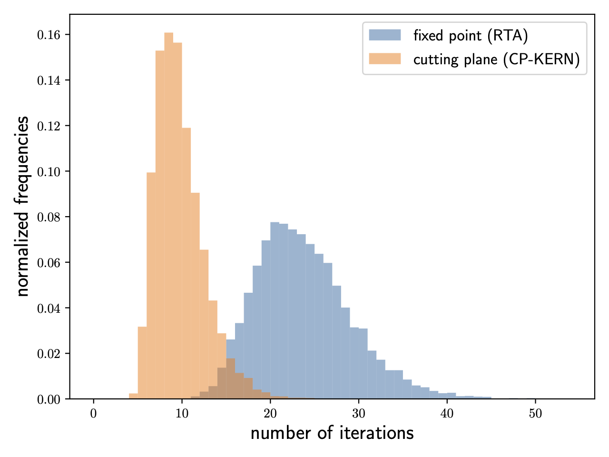

# CUTTING-PLANE ALGORITHMS FOR PREEMPTIVE UNIPROCESSOR REAL-TIME SCHEDULING PROBLEMS

This repository is the official implementation of [Cutting-plane algorithms for
  preemptive uniprocessor real-time scheduling
  problems](https://arxiv.org/abs/2210.11185).

In this paper, we show that fixed-point iteration algorithms like RTA and QPA
are suboptimal cutting-plane algorithms for specific integer programming
formulations of fixed-priority and earliest-deadline-first schedulability
problems; the optimal algorithm, discovered in this paper, converges more
quickly to the solution:



This repository is primarily intended to be a companion to the arxiv paper. It
contains
- a simple implementation of a hard real-time task (see
  [task.py](rtsched/system/task.py));
- a method for generating random systems of hard real-time tasks (see
  [generate_random.py](rtsched/system/generate_random.py));
- instrumented implementations of FP-KERN, IP-KERN, and CP-KERN that count the
  number of iterations used by the algorithm (see
  [kernel.py](rtsched/sched_test/kernel.py));
- the reduction from FP schedulability to the kernel described in
  Appendix A (see [fp.py](rtsched/sched_test/fp.py));
- the reduction from EDF schedulability to the kernel described in Appendix B
 (see [edf.py](rtsched/sched_test/edf.py));
- tests that ensure consistency with traditional schedulability tests like
  RTA and QPA (see [tests](rtsched/tests));
- a script for running the experiments and generating the associated data and
  images (see [exp.py](./exp.py)); and
- historical data and images generated from running the experiments (see
  [hist](./hist)).

The algorithms have not been implemented to optimize for *real* performance: for
instance, we use arbitrary-precision Python integers instead of floats to err on
the side of caution, and we use the number of iterations required by each
algorithm as to measure performance in our experiments (not wall-clock time).
These choices are justified because we really want to understand the
*algorithms*, not the *implementations*. The number of iterations required for
convergence is a property of the algorithm that is independent of the
implementation. The repository should serve as a useful starting point for
someone interested in developing schedulability tests that run quickly in
*reality* (maybe use a language with good support for parallel programming).

## Requirements

1. Install [hatch](https://hatch.pypa.io/latest/install/).

2. Clone this repository.

3. Make a virtual Python 3.8 environment. I use
   [pyenv-virtualenv](https://github.com/pyenv/pyenv-virtualenv) but feel free
   to use your favorite method.

4. Activate the virtual environment.

5. Install the rtsched package:

```
pip install .
```

## Testing

Test the correctness of the implementation:

```
pytest --doctest-modules
```

## Evaluation

Run the experiments:

```
python exp.py
```

The last 50 lines of the script specify the parameters that govern the random
real-time systems generation, e.g., `seed`, `ns`, `ds`, `us`, etc., and the
files where the results are stored. Basic Python literacy is needed to
understand and modify these lines to get the behavior you want. By default, the
script runs the experiments described in Figures 2 and 4 in the paper for a
small number of randomly generated systems (`num_systems = 100`); the number can
be increased to `10000` but then it may take an hour or two to run (at least it
does on my machine with an 2.6 GHz Intel Core i7 processor).

## Results

The results are described in Section 6 of the paper, and they should match the
results produced by this code.

## History

Version 0.1.1 (2023-02-21)

## Credits

Abhishek Singh

## DOI

[](https://zenodo.org/badge/latestdoi/604422991)

## License

[](https://opensource.org/licenses/MIT)

## Contributing

Feel free to open an issue.

## Other useful real-time systems projects

The following projects have broader scopes than ours, and may be useful to
people who have stumbled onto this page.

- [rtsim](http://rtsim.sssup.it/)
- [schedcat](https://github.com/brandenburg/schedcat)
- [simso](https://github.com/MaximeCheramy/simso)
